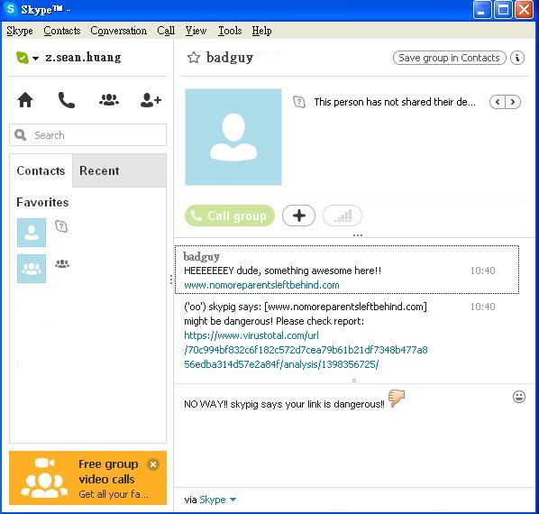

SkyPig
------
SkyPig = skype + sniffer. This project bases on skype4py and protects you from malicious link while using skype

Dependencies
------------
python [`skype4py`](https://github.com/awahlig/skype4py)
python [`vtapi`](https://github.com/z-sean-huang/VirustotalAPI)

License
-------
BSD 3-Clause 

COMING SOOOOOOOON!
------------------

